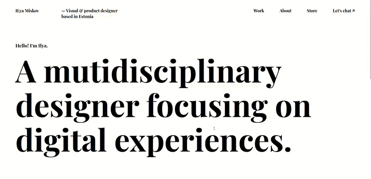
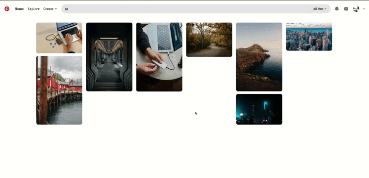

# Projects

## Static Web Pages

### [1. Dental Care Landing Page](./Static/Readme.md#1-dental-care-landing-page)

- A simple webpage using **HTML** and **CSS**.

**Features:**

- **HTML/CSS** for design
- Icons: **Font Awesome** & **Remix Icon**
- Typography: **Google Fonts**
- Images: **Unsplash**

[**Live Preview**](https://sandip3.github.io/Web-Project/Static/project%20-%201/)

---

### [2. Bent Template Clone](./Static/Readme.md#2-bent-template-clone)

- A static webpage clone of the [**Bent Template**](https://bent-template.webflow.io/).

**Tech Stack:**

- **HTML/CSS**
- Icons: **Remix Icon**
- Fonts: **Google Fonts**
- Images: **Unsplash**

[**Live Preview**](https://sandip3.github.io/Web-Project/Static/project%20-%202/index.html)

---

### [3. Web Page Clone](./Static/Readme.md#3-web-page-clone)

- A static webpage clone of a design from an image [here](https://pbs.twimg.com/media/Fw72tysXgAcp9EO?format=jpg&name=900x900).

**Tech Stack:**

- **HTML/CSS**
- Icons: **Remix Icon**
- Fonts: **Google Fonts**
- Images: **Unsplash**

[**Live Preview**](https://sandip3.github.io/Web-Project/Static/project%20-%203/index.html)

---

### [4. Pinterest Clone](./Static/Readme.md#4-pinterest-clone)

- A static webpage inspired by Pinterest's design.

**Tech Stack:**

- **HTML/CSS/JavaScript** for structure, styling, and interactivity
- Icons: **Remix Icon**
- Styling: **Tailwind CSS**
- Images: **Unsplash**

[**Live Preview**](https://sandip3.github.io/Web-Project/Static/project%20-%204%20pinterest/)

---
