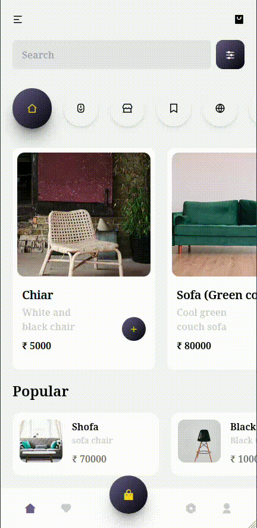

# Static Web Page

## 1. [Dental Care Landing Page](./project%20-%201/index.html)

- **HTML** and **CSS** based static webpage.

**Technologies Used:**

- **HTML/CSS** for design
- **Font Awesome**, **Remix Icon** for icons
- **Google Fonts** for typography
- **Unsplash** for images

**Preview:** [Live Version](https://sandip3.github.io/Web-Project/Static/project%20-%201/)

**Screenshots:**

---

## 2. [Bent Template Clone](./project%20-%202/index.html)

- Clone of the **[Bent Template](https://bent-template.webflow.io/)**.

**Technologies Used:**

- **HTML/CSS** for design
- **Remix Icon** for icons
- **Google Fonts** for typography
- **Unsplash** for images

**Preview:** [Live Version](https://sandip3.github.io/Web-Project/Static/project%20-%202/index.html)

**Screenshots:**

---

## 3. [Web Page Clone](./project%20-%203/index.html)

- Clone of a design from [this image](https://pbs.twimg.com/media/Fw72tysXgAcp9EO?format=jpg&name=900x900).

**Technologies Used:**

- **HTML/CSS** for design
- **Remix Icon** for icons
- **Google Fonts** for typography
- **Unsplash** for images

**Preview:** [Live Version](https://sandip3.github.io/Web-Project/Static/project%20-%203/index.html)

**Screenshots:**

---

## 4. [Pinterest Clone](./project%20-%204%20pinterest/index.html)

- Inspired by Pinterest design.

**Technologies Used:**

- **HTML/CSS/JavaScript** for structure and interactivity
- **Remix Icon** for icons
- **Tailwind CSS** for styling
- **Unsplash** for images

**Preview:** [Live Version](https://sandip3.github.io/Web-Project/Static/project%20-%204%20pinterest/)

**Screenshots:**

---

## 5. [Cart Function](./project%20-%205%20cart/index.html)

- Static page with **cart functionality**, optimized for mobile view.

**Technologies Used:**

- **HTML/CSS/JavaScript**
- **Remix Icon** for icons
- **Tailwind CSS** for styling

**Preview:** [Live Version](https://sandip3.github.io/Web-Project/Static/project%20-%205%20cart/)

**Screenshots:**

---

## 6. [Music Player](./project%20-%206%20Music%20Player/index.html)

- Simple music player on a static page.

**Technologies Used:**

- **HTML/CSS/JavaScript**
- **Remix Icon** for icons

**Features:**

- Play/pause, next, and previous buttons
- Click on songs to change tracks
- No progress bar

**Preview:** [Live Version](https://sandip3.github.io/Web-Project/Static/project%20-%206%20Music%20Player/)

**Screenshots:**

---
