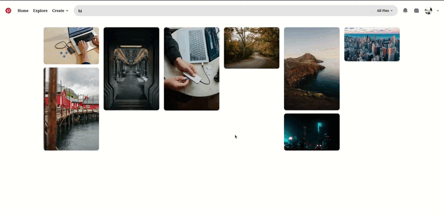

# Static Web Page

## 1. [Dental Care Landing Page](./project%20-%201/index.html)

- A static webpage built using a combination of **HTML** and **CSS**.

## Technologies Used

- **HTML** and **CSS** for structure and styling
- **Font Awesome** for icons
- **Remix Icon** for additional icons
- **Google Fonts** for custom typography
- **Unsplash** for high-quality images

## Preview

Check out the live version of the page [here](https://sandip3.github.io/Web-Project/Static/project%20-%201/).

## Screenshots

 

---

## 2. [Bent Template Clone](./project%20-%202/index.html)

- A static webpage clone of the **[Bent Template](https://bent-template.webflow.io/)**.

## Technologies Used

- **HTML** and **CSS** for structure and styling
- **Remix Icon** for icons
- **Google Fonts** for custom typography
- **Unsplash** for high-quality images

## Preview

Check out the live version of the clone [here](https://sandip3.github.io/Web-Project/Static/project%20-%202/index.html).

## Screenshots

 

---

## 3. [Web Page Clone](./project%20-%203/index.html)

- A static webpage clone of a design from an image [here](https://pbs.twimg.com/media/Fw72tysXgAcp9EO?format=jpg&name=900x900).

## Technologies Used

- **HTML** and **CSS** for structure and styling
- **Remix Icon** for icons
- **Google Fonts** for custom typography
- **Unsplash** for high-quality images

## Preview

Check out the live version of the page [here](https://sandip3.github.io/Web-Project/Static/project%20-%203/index.html).

## Screenshots

 

---

## 4. [Pinterest Clone](./project%20-%204%20pinterest/index.html)

- A static webpage clone inspired by the Pinterest design.

## Technologies Used

- **HTML**, **CSS**, and **JavaScript** for structure, styling, and interactivity
- **Remix Icon** for icons
- **Tailwind CSS** for utility-first styling
- **Unsplash** for high-quality images

## Preview

Check out the live version of the page [here](https://sandip3.github.io/Web-Project/Static/pinterest/index.html).

## Screenshots

---

## 
